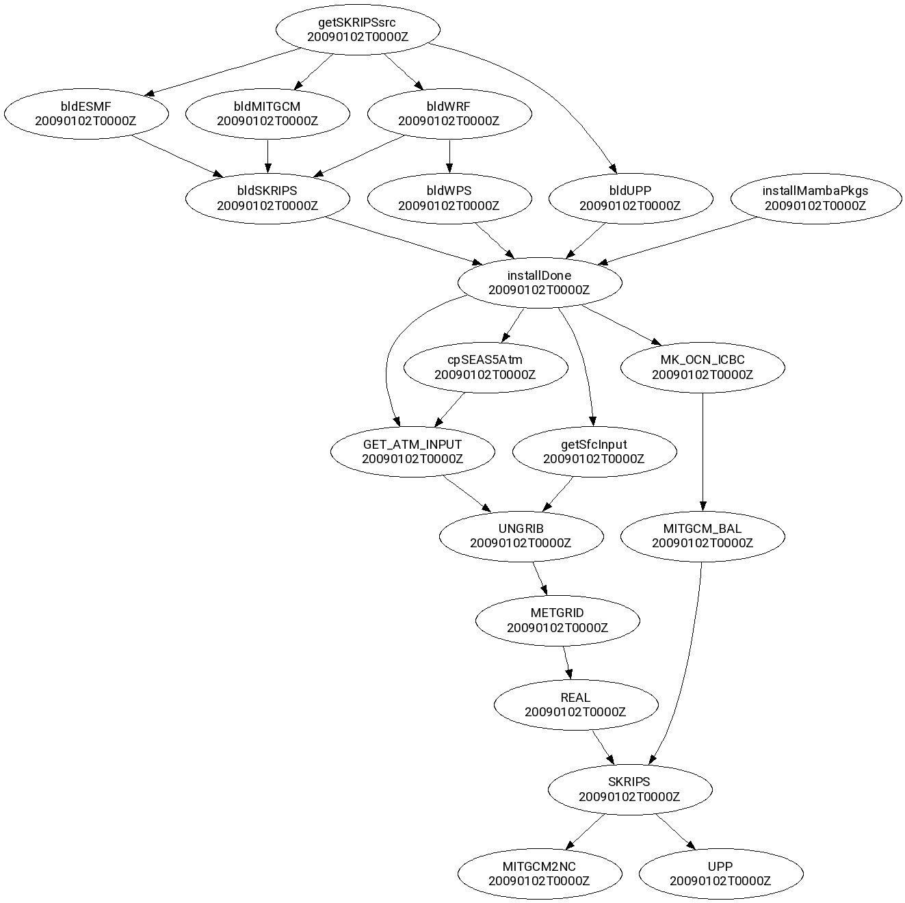

# Cylc Workflow for Downscaling Seasonal Reforecast for AP Region Using SKRIPS Coupled Model


## Directory Structure
- flow.cylc
- params.cylc
- **include**
- **fix**
- **parm**
- **bin**


## Design Principles

### Workflow Independence
- The workflow should function out-of-the-box, requiring only large input datasets as external dependencies.
- All other components (parameter files, scripts, utilities, model code) should be installed and configured by the workflow itself.
- Dependency installation and configuration should be the initial step.
- Subsequent tasks should depend on the successful completion of dependency installation.

## `flow.cylc` Structure

### General Guidelines
- Use four <space> indentations in `flow.cylc` file. Do not use <tabs>.
- Define each dependency on a separate line in the `[[graph]]` section.
- Avoid including site-specific details in the main `flow.cylc` file.
- Use Jinja2 include files for site-specific configurations.
    - For e.g. A site include file `include/<SITE>/flow.cylc` is included at the end of main `flow.cylc` as:
    ```
        

    ```
- Do not use inheritance in site include files to prevent overriding any inheritance defined in the main `flow.cylc`.
- Keep the `[runtime][root]` section minimal.
- Minimize the use of Jinja2; prefer task parameterization.

### Task Scripts
- **pre-script**: Set up the run directory and perform pre-job configurations (e.g., editing namelists, copying/linking necessary input and forcing files).
- **script**: Launch the actual job (e.g., `mpirun -np 4 wrf.exe`).
- **post-script**: Perform post-run tasks (e.g., moving the outputs).
- Ensure pre-script, script, and post-script are site-agnostic.
- The parallel job launching command (e.g. `mpirun -np 4`) in the script will be site-specific. Provide this through the site include file by setting `[[[environment]]] run_cmd` for the applicable tasks.
- **env-script**: Include site-specific environment loading commands (e.g., `module load`, `mamba activate`).
  - Note: Variables defined in `[[[environment]]]` are not visible in env-script, as env-script is invoked before `[[[environment]]]`.

## Code Quality and Style
- Use `cylc lint` to check the Cylc code style.
- Use `shfmt` for formatting bash scripts.
- Use the `black` formatter for Python code.


For more information on writing workflows see the
[user guide](https://cylc.github.io/cylc-doc/stable/html/user-guide/writing-workflows/index.html).

There is also a
[workflow design guide](https://cylc.github.io/cylc-doc/stable/html/workflow-design-guide/index.html).

## Work flow graph


